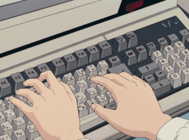
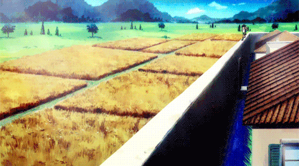

<body>

</img>

 

 

<h2 align="center"> 💬 𝘼𝙗𝙤𝙪𝙩 𝙢𝙚 🗨️ </h2>

<li>
<b>Name:</b> Muhammad Usman</li>
<li>
<b>Gender:</b> Male
</li>
<li>
<b>Hobby:</b> Linux Enthusiast🐧, Tech stuff, web development, solve algorithm puzzles to some degree (although I'm pretty bad at this), anime, games
</li>
 

<b>     Thanks for reading about my personal stuff 
                                 💯❤️‍🔥</b>

<h2 align="left">            📇 𝙆𝙣𝙤𝙬𝙡𝙚𝙙𝙜𝙚/ 𝙆𝙣𝙤𝙬𝙣 𝙖𝙗𝙤𝙪𝙩 📇</h2>

 
  
  
 

 
 
<h2 align="center">⌨️ 𝙒𝙤𝙧𝙠 𝙀𝙭𝙥𝙚𝙧𝙞𝙚𝙣𝙘𝙚 🖱️</h2>

 
 
 
I am a <strong>hobbyist developer</strong> with experience in <i><ins>C, Rust, Go, TypeScript</ins></i> and in frontend framworks like <i><ins>Svelte, Nextjs, Nuxtjs,Remix.</ins></i> In backend, I have worked with <i><ins>Nodejs, Expressjs, Prisma, MongoDB, Postgresql.</ins></i>

 
<h2 align="right">📝 𝘾𝙤𝙣𝙩𝙖𝙘𝙩 𝙢𝙚 📝            </h2>

 

Here are some of my   
most used social info ヽ(o＾▽＾o)ノ

   📱: +92 313 1516415

 

 

    <h2 align ="center">⚔️ Stats 𝙇𝙀𝙑𝙀𝙇 𝙐𝙋! 🛡️</h2>
    
     
    
     
     
     
     
     
     
    

 
 
 
 
 
 
 
 
 
 
 
 
 
 
 

<h2 align="center">💖 𝙏𝙝𝙖𝙣𝙠𝙨 𝙛𝙤𝙧 𝙬𝙖𝙡𝙠𝙞𝙣𝙜 𝙩𝙝𝙧𝙤𝙪𝙜𝙝 𝙢𝙮 𝙥𝙧𝙤𝙛𝙞𝙡𝙚! 💖</h2>

</body>
